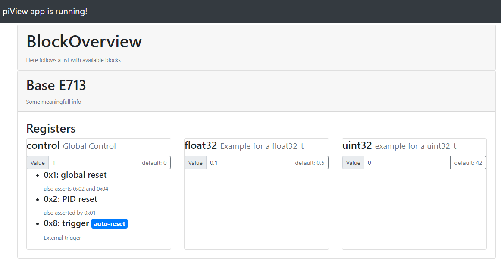

# FPGA BlockDesign - PyView

A FPGA block overview using a Flask Banckend and an angular frontend.
Before Running the application please make sure your prereqs are fulfilled as described in the Setup section.

### Structure
Within the `backend` folder contains a python project, serving a [flask_restful](https://flask-restful.readthedocs.io/en/latest/) api.
The `frontend` folder is a [angular](https://angular.io) app, that visualizes the contents of the api.

## Run

- Run the flask backend with your config
  ```shell
  python -m piView.serve example/config.yml
  ```

  For debuging environment use the -debug flag
  ```shell
  python -m piView.serve example/config.yml -debug
  ```

- Serve the Angular frontend.
  ```shell
  cd frontend
  ng serve
  ```

Your local page should the look like this


## Setup

This package uses venv module.
```shell
python -m venv .venv
```

To activate the environment using PowerShell
```powershell
# optionally allow remote signed scripts for current user
Set-ExecutionPolicy -ExecutionPolicy RemoteSigned -Scope CurrentUser

.venv/Scripts/Activate.ps1
```

### Requirements

#### Backend
Install anything you need to your newly created environment
```shell
pip install -r requirements.txt
```

Adding Packages can ba done via pip.
```shell
pip install <some_package>
```

Requirements might be frozen to document dependencies.
```shell
pip freeze > requirements.txt
```

##### Install PiView
We make use of setuptools in the `setup.py`
```shell
python setup.py install
```

For developers consider running. The `--user` flag has to be ommited when installing in (venv)
```shell
python setup.py develop --user
```

### Frontend


- First install [NodeJs](https://nodejs.org/)
- Then add [angular cli](https://cli.angular.io/)
  ```shell
  npm install -g @angular/cli
  ```

### Test

In order to test the Backend use pythons unittests
```shell
python -m unittest discover backend/Test Test*.py
```
